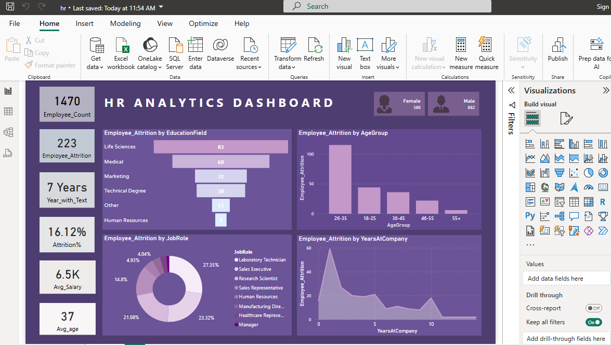
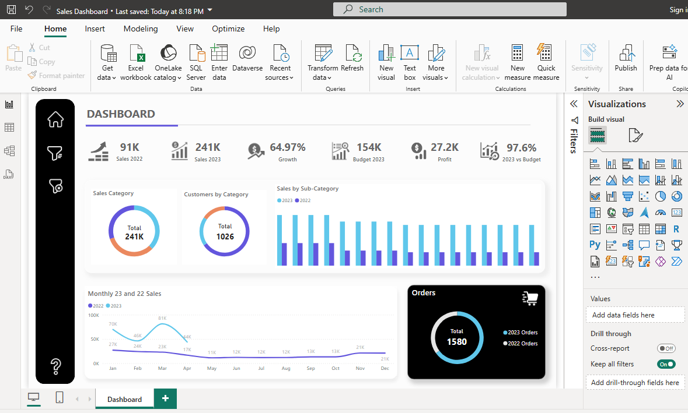

# Sales-Dashboard-PowerBI
This repository contains two interactive Power BI dashboards designed to showcase real-world data analysis skills:

# 📊 Power BI Projects Portfolio

This repository contains two interactive Power BI dashboards designed to showcase real-world data analysis skills:

1. **HR Analytics Dashboard**
2. **Sales Performance Dashboard**

---

## 📁 Files

| File Name            | Description                         |
|---------------------|-------------------------------------|
| `HR_Analytics.pbix` | Power BI dashboard for HR metrics   |
| `Sales_Dashboard.pbix` | Power BI dashboard for sales data |
| `images/hr_dashboard.png` | Screenshot of HR Dashboard     |
| `images/sales_dashboard.png` | Screenshot of Sales Dashboard |

---

## 1️⃣ HR Analytics Dashboard

### 🧠 Objective:
To analyze employee attrition patterns using factors like education, age, job role, and years at company.

### 📌 Key Metrics:
- Total Employees: 1470
- Attrition Count: 223
- Average Salary: 6.5K
- Average Age: 37
- Attrition %: 16.12%

### 📊 Visuals:
- **Bar chart**: Attrition by Education Field and Age Group
- **Pie chart**: Attrition by Job Role
- **Line chart**: Attrition by Years at Company
- **Cards**: Gender count, avg salary, years with company, etc.

### 📷 Screenshot:

---

## 2️⃣ Sales Performance Dashboard

### 🧠 Objective:
To monitor and evaluate sales performance across years, categories, and customer segments.

### 📌 Key Metrics:
- Sales in 2022: 91K
- Sales in 2023: 241K
- Growth: 64.97%
- Profit: 27.2K
- Orders: 1580
- Budget Achievement: 97.6%

### 📊 Visuals:
- **Doughnut charts**: Sales and Customer Categories
- **Column chart**: Sub-category sales for 2022 vs 2023
- **Line chart**: Monthly Sales Trend
- **KPI tiles**: Budget, Sales, Profit, Growth

### 📷 Screenshot:

---

## 🚀 How to Use

1. Clone or download this repository
2. Open `.pbix` files in Power BI Desktop
3. Review visuals and customize as needed
4. Replace data source with your own if required

---

## 💡 Tools Used

- Power BI Desktop
- Excel/CSV for data source (optional)
- DAX measures and calculated columns

